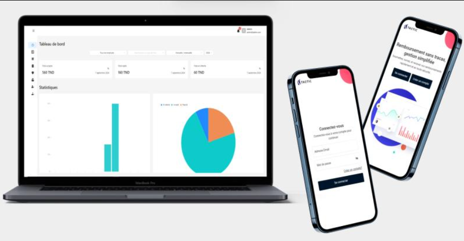

# Reimbursement Management System (Frontend)

This project is a **Reimbursement Management System** designed to help employees manage and request reimbursements for their insurance benefits. The system allows users to submit requests, track their status, and view their reimbursement history in a user-friendly interface.

## Table of Contents
- [Project Overview](#project-overview)
- [Demo](#demo)
- [Features](#features)
- [Technologies Used](#technologies-used)

## Project Overview
The **Reimbursement Management System** provides an efficient solution for managing reimbursement requests for insurance benefits. The frontend is built with a focus on ease of use, ensuring that employees can effortlessly navigate through different features, such as submitting new requests, viewing past reimbursements, and tracking the status of their submissions.

## Demo
You can view a live demonstration of the **Reimbursement Management System** directly below. Click on the image to view the demo:

## Features
- **User Authentication**: Secure login and registration for employees and administrators.
- **Request Reimbursements**: Allows employees to submit reimbursement requests with necessary details and supporting documents.
- **Track Status**: Employees can track the approval status of their reimbursement requests in real-time.
- **View Reimbursement History**: Users can view a history of all their submitted and approved reimbursements.
- **Admin Dashboard**: Accessible only to administrators, featuring statistics and the ability to review, manage requests.

## Technologies Used
- **React**: For building the user interface and managing the application state.
- **Ant Design**: Provides a set of elegant and responsive UI components.
- **Axios**: For handling HTTP requests to interact with the backend API.
- **Vite**: For fast development and optimized builds.
- **Bootstrap**: For responsive and consistent styling.
